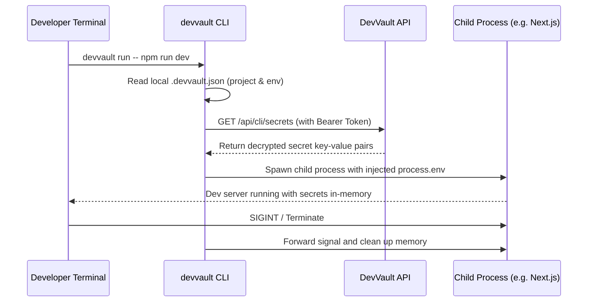

# Feature Specification: Developer CLI & Local Injection (`devvault-cli`)

- **Status**: Proposed
- **Priority**: P1 (High)
- **Target Component**: CLI Tooling, Personal Access Tokens & Developer Experience

---

## 1. Problem Statement

One of the primary drivers behind the success of **Doppler** and **Infisical** is their command-line interface. Developers do not want to manually log into a web UI, click "Export", download a `.env.local` file, and move it to their project directory every time a secret changes. Furthermore, storing plaintext `.env` files on developer laptops introduces the danger of accidental git commits.

A developer CLI allows developers to inject secrets directly into application runtime memory without writing a physical `.env` file to disk.

---

## 2. User Stories

1. **As a Developer**, I want to run `devvault run -- npm run dev` to automatically fetch secrets from my project vault and inject them as environment variables into my dev server process.
2. **As a Developer**, I want to run `devvault pull` to generate a local `.env` file when working with tools that strictly require filesystem configurations (e.g. Prisma CLI, Docker Compose).
3. **As a CI/CD Engineer**, I want to use a Personal Access Token (PAT) to securely fetch secrets in automated deployment pipelines.

---

## 3. CLI Command Architecture

```bash
# 1. Authenticate the CLI with DevVault
$ npx devvault login
# Opens browser to approve authorization token

# 2. Link current working directory to a DevVault project
$ npx devvault link --project my-next-app --env dev
# Creates a minimal .devvault.json metadata pointer in current directory

# 3. Inject secrets directly into child process without creating a .env file on disk
$ npx devvault run -- pnpm dev
# Injects process.env and launches command

# 4. Pull decrypted secrets into local file
$ npx devvault pull --format env.local
# Writes .env.local with secure permissions (chmod 600)
```

---

## 4. Backend Authentication: Personal Access Tokens (PAT)

### Mongoose Model: `ApiKey` (`src/models/ApiKey.ts`)

```typescript
import mongoose, { Schema, Document, Types } from 'mongoose'
import { hashValue } from '@/utils/encryption'

export interface IApiKey extends Document {
	userId: string
	name: string
	keyPrefix: string
	hashedKey: string
	lastUsedAt?: Date
	expiresAt?: Date
	createdAt: Date
}

const apiKeySchema = new Schema<IApiKey>(
	{
		userId: { type: String, required: true, index: true },
		name: { type: String, required: true },
		keyPrefix: { type: String, required: true }, // e.g. "dv_live_abc123"
		hashedKey: {
			type: String,
			required: true,
			set: (rawKey: string) => hashValue(rawKey),
		},
		lastUsedAt: { type: Date },
		expiresAt: { type: Date },
	},
	{ timestamps: true },
)

export const ApiKey =
	mongoose.models.ApiKey || mongoose.model<IApiKey>('ApiKey', apiKeySchema)
```

---

## 5. CLI Execution Lifecycle



---

## 6. Security Considerations

- **Memory-only Injection**: Secrets are piped directly to the spawned child process via Node's `child_process.spawn(..., { env: { ...process.env, ...secrets } })`, leaving zero traces on the hard drive.
- **Gitignore Safeguard**: Running `devvault link` automatically inspects `.gitignore` and appends `.env*` and `.devvault/` entries to ensure no secret artifacts are ever tracked in git.
