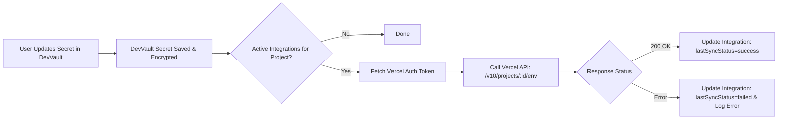

# Feature Specification: CI/CD & Third-Party Platform Sync

- **Status**: Proposed
- **Priority**: P2 (Medium)
- **Target Component**: Integrations, Webhooks & Automated Deployment Sync

---

## 1. Problem Statement

When an API secret or database credential is rotated in DevVault, developers must manually log into **Vercel**, **GitHub**, **Railway**, and other deployment targets to re-enter the new value. Inevitably, one platform is forgotten, resulting in production downtime during subsequent deployments.

Top secrets managers feature automated **Platform Syncing**: whenever a secret is saved in the vault, it is automatically pushed to third-party providers via their native REST APIs.

---

## 2. Supported Target Platforms

1. **Vercel**: Sync environment variables to Vercel project environments (`Production`, `Preview`, `Development`).
2. **GitHub Actions Secrets**: Push encrypted repository or organization secrets for automated CI/CD workflows.
3. **Custom Outgoing Webhooks**: Send encrypted HMAC-signed webhook payloads to custom endpoints on secret updates (triggering automated container restarts or cache invalidations).

---

## 3. Data Architecture

### Mongoose Model: `Integration` (`src/models/Integration.ts`)

```typescript
import mongoose, { Schema, Document, Types } from 'mongoose'
import { encryptValue, decryptValue } from '@/utils/encryption'

export type IntegrationProvider = 'vercel' | 'github' | 'webhook'

export interface IIntegration extends Document {
	projectId: Types.ObjectId
	provider: IntegrationProvider
	name: string
	environmentMapping: {
		sourceEnv: 'dev' | 'staging' | 'prod' | 'test'
		targetEnv: string
	}[]
	encryptedAuthToken: string
	targetIdentifier: string // e.g. Vercel Project ID or GitHub repo "owner/repo"
	isActive: boolean
	lastSyncAt?: Date
	lastSyncStatus?: 'success' | 'failed'
	lastSyncError?: string
	createdAt: Date

	getDecryptedToken(): string
}

const integrationSchema = new Schema<IIntegration>(
	{
		projectId: {
			type: Schema.Types.ObjectId,
			ref: 'Project',
			required: true,
			index: true,
		},
		provider: {
			type: String,
			enum: ['vercel', 'github', 'webhook'],
			required: true,
		},
		name: { type: String, required: true },
		environmentMapping: [
			{
				sourceEnv: { type: String, required: true },
				targetEnv: { type: String, required: true },
			},
		],
		encryptedAuthToken: {
			type: String,
			required: true,
			set: (token: string) => encryptValue(token),
		},
		targetIdentifier: { type: String, required: true },
		isActive: { type: Boolean, default: true },
		lastSyncAt: { type: Date },
		lastSyncStatus: { type: String, enum: ['success', 'failed'] },
		lastSyncError: { type: String },
	},
	{ timestamps: true },
)

integrationSchema.methods.getDecryptedToken = function (): string {
	return decryptValue(this.encryptedAuthToken)
}

export const Integration =
	mongoose.models.Integration ||
	mongoose.model<IIntegration>('Integration', integrationSchema)
```

---

## 4. Sync Engine Flow (Vercel Example)



---

## 5. UI/UX Workflow

1. Accessible via `/dashboard/projects/[id]/integrations`.
2. Card list displaying available connectors:
   - **Vercel** (`Connect with Vercel API Token`)
   - **GitHub** (`Connect with GitHub Personal Access Token`)
   - **Custom Webhook** (`URL & HMAC Secret`)
3. Configuration Modal:
   - Map DevVault `prod` -> Vercel `Production`.
   - Map DevVault `dev` -> Vercel `Development`.
4. "Sync Now" button with status pills (green checkmark for synced, red alert for sync errors).
