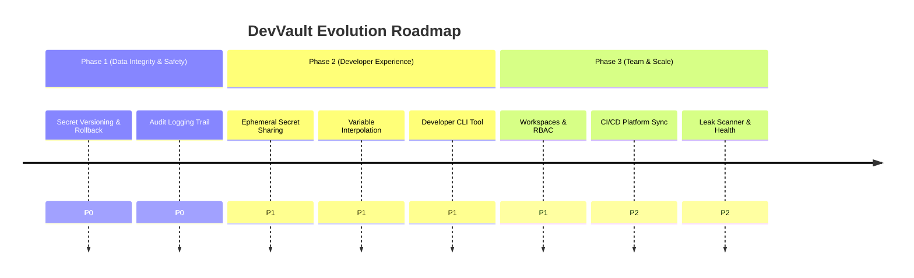

# 🗺️ DevVault Feature Roadmap & Gap Analysis

This directory contains technical specifications and architectural designs for missing features in **DevVault**, benchmarked against industry standards like **Doppler**, **Infisical**, **1Password for Developers**, and **HashiCorp Vault**.

---

## 📊 Feature Comparison Matrix

| Feature Domain              | Current DevVault               | Industry Standard                                     | Target DevVault Spec                                       | Priority          |
| --------------------------- | ------------------------------ | ----------------------------------------------------- | ---------------------------------------------------------- | ----------------- |
| **Secret Versioning**       | In-place overwrite; no history | Immutable versions, historical diff, 1-click rollback | Version snapshots, diff viewer, rollback API               | **P0 (Critical)** |
| **Audit Trails**            | No access logging              | Complete event trail (view, export, edit, copy)       | Tamper-resistant audit log with IP/UA & filtering          | **P0 (Critical)** |
| **Secret Sharing**          | Manual copy-paste              | E2E encrypted, burn-after-reading links               | Ephemeral links, view/time expiration, password protection | **P1 (High)**     |
| **Variable Interpolation**  | Static strings only            | Dynamic `${VAR}` expansion, cross-env references      | Dependency graph resolver, cycle prevention                | **P1 (High)**     |
| **Team Collaboration**      | Single-user owner only         | Multi-tenant workspaces, granular RBAC                | Workspaces, roles (Owner/Admin/Dev/Viewer), env gates      | **P1 (High)**     |
| **Terminal / CLI**          | Web dashboard only             | Terminal process injection (`doppler run -- ...`)     | `devvault-cli` with process injection & sync               | **P1 (High)**     |
| **CI/CD & Sync**            | Manual download/copy           | Native sync to Vercel, GitHub, AWS, Webhooks          | 1-click Vercel/GitHub integration & webhooks               | **P2 (Medium)**   |
| **Secret Health & Scanner** | Simple `.env.example` key diff | Regex leak detection, entropy & strength scoring      | Health score dashboard, pattern detection                  | **P2 (Medium)**   |

---

## 📑 Feature Specification Index

1. **[01. Secret Versioning & Rollback History](./01-secret-versioning-and-rollback.md)**
   Track every change to environment variables with full diffing, user attribution, and instant rollback.
2. **[02. Audit Logging & Compliance Trails](./02-audit-logging-and-compliance.md)**
   Immutable audit log recording secret reveals, exports, edits, and administrative operations.
3. **[03. Ephemeral Secret Sharing (Burn-After-Reading)](./03-ephemeral-secret-sharing.md)**
   Zero-knowledge, self-destructing secret links with passphrases and click limits.
4. **[04. Variable Interpolation & References](./04-variable-interpolation-and-references.md)**
   Dynamic `${DB_HOST}:${DB_PORT}` variable expansion with circular dependency validation.
5. **[05. Workspaces & Role-Based Access Control (RBAC)](./05-workspaces-and-rbac.md)**
   Multi-user collaboration, project sharing, and environment-level permission gates.
6. **[06. Developer CLI & Local Injection](./06-developer-cli-and-sdk.md)**
   Command-line tool to pull secrets and inject them directly into child dev processes.
7. **[07. CI/CD & Third-Party Platform Sync](./07-cicd-and-platform-integrations.md)**
   Automated secret synchronization with Vercel, GitHub Actions Secrets, and custom webhooks.
8. **[08. Secret Leak Scanner & Health Diagnostics](./08-secret-leak-scanner-and-health.md)**
   Live scanning for exposed credentials, entropy evaluation, and security health diagnostics.

---

## 🏗️ Implementation Phase Roadmap

